# CollabCanvas MVP - System Architecture

## Overview

This architecture diagram shows the complete system design for CollabCanvas, a real-time collaborative design tool built with React and Firebase. The system emphasizes **multiplayer-first architecture** with SVG-based rendering, object locking for conflict resolution, and sub-50ms real-time synchronization.

## Key Architectural Highlights

- **Rendering Engine:** SVG-based canvas with viewBox transformations for pan/zoom
- **Authentication:** GitHub OAuth (primary), extensible to Google/email
- **Real-time Sync:** Firestore `onSnapshot` listeners for <50ms cursor sync, <100ms object sync
- **Conflict Resolution:** Object locking mechanism prevents simultaneous manipulation
- **ID Generation:** Composite IDs (`userId_timestamp`) prevent creation conflicts
- **State Management:** React hooks + Firestore real-time subscriptions
- **Canvas Boundaries:** Fixed canvas size with visible borders and enforced panning limits
- **Color Assignment:** Pseudorandom selection from hardcoded palette (3-5 colors)

## System Diagram

```mermaid
graph TB
    subgraph "Client Browser"
        subgraph "React Application"
            App[App.jsx<br/>Main App Component<br/>Auth Routing]
            
            subgraph "Components Layer"
                Canvas[Canvas.jsx<br/>SVG Canvas Container<br/>Pan/Zoom/Events<br/>Boundaries]
                Rectangle[Rectangle.jsx<br/>SVG Rectangle<br/>Selection Highlight<br/>Lock Indicator]
                Cursor[Cursor.jsx<br/>SVG Cursor Display<br/>Hover Labels<br/>Overlap Resolution]
                Presence[PresenceSidebar.jsx<br/>Online Users Sidebar]
                Login[LoginPage.jsx<br/>GitHub OAuth Login]
                Auth[AuthButton.jsx<br/>Logout UI]
            end
            
            subgraph "Hooks Layer"
                useAuth[useAuth.js<br/>Auth State Management<br/>Display Name Fallback]
                useCanvas[useCanvas.js<br/>Canvas Objects State<br/>Object Locking<br/>Composite IDs]
                useCursors[useCursors.js<br/>Cursor Positions State<br/>Arrival Time Tracking]
                usePresence[usePresence.js<br/>Presence State<br/>Heartbeat]
            end
            
            subgraph "Services Layer"
                FirebaseService[firebase.js<br/>Firebase Config<br/>Auth/DB Instances<br/>GitHub OAuth]
                CanvasService[canvasService.js<br/>CRUD Operations<br/>Lock/Unlock Objects<br/>Real-time Subscriptions]
            end
            
            subgraph "Utils Layer"
                CanvasUtils[canvasUtils.js<br/>Coordinate Transform<br/>Collision Detection<br/>SVG Helpers]
                ColorUtils[colorUtils.js<br/>Pseudorandom Colors<br/>Hardcoded Palette]
                Constants[constants.js<br/>Config & Defaults<br/>Canvas Boundaries<br/>Color Palette]
            end
        end
    end
    
    subgraph "Firebase Backend"
        subgraph "Firebase Auth"
            AuthProvider[GitHub OAuth Provider<br/>Primary<br/>Extensible: Google/Email]
            AuthState[User Authentication<br/>Session Management<br/>Display Name/Username]
        end
        
        subgraph "Firestore Database"
            subgraph "canvases/{canvasId}"
                ObjectsCol[(objects/<br/>id: userId_timestamp<br/>lockedBy field<br/>color, position)]
                CursorsCol[(cursors/<br/>positions<br/>arrivalTime<br/>userName)]
                PresenceCol[(presence/<br/>online users<br/>lastSeen<br/>heartbeat)]
            end
        end
        
        FirebaseHosting[Firebase Hosting<br/>Static Site Deploy]
    end
    
    subgraph "Browser APIs"
        SVG[SVG Rendering<br/>viewBox Transform<br/>rect elements]
        Mouse[Mouse Events<br/>Click-to-Select<br/>Drag/Pan/Zoom]
        Hover[Hover Events<br/>Cursor Labels<br/>Object Highlighting]
    end

    %% Component to Hook connections
    App --> Login
    App --> Auth
    App --> Canvas
    Canvas --> Rectangle
    Canvas --> Cursor
    Canvas --> Presence
    
    Login --> useAuth
    Auth --> useAuth
    Canvas --> useCanvas
    Canvas --> useCursors
    Canvas --> usePresence
    
    %% Hook to Service connections
    useAuth --> FirebaseService
    useCanvas --> CanvasService
    useCursors --> CanvasService
    usePresence --> CanvasService
    
    %% Service to Firebase connections
    FirebaseService --> AuthProvider
    FirebaseService --> AuthState
    CanvasService --> ObjectsCol
    CanvasService --> CursorsCol
    CanvasService --> PresenceCol
    
    %% Canvas rendering connections
    Canvas --> CanvasUtils
    Canvas --> ColorUtils
    Canvas --> Constants
    Rectangle --> CanvasUtils
    Rectangle --> ColorUtils
    Canvas --> SVG
    Canvas --> Mouse
    Canvas --> Hover
    
    %% Real-time data flow
    ObjectsCol -.Real-time Sync<br/>onSnapshot.-> useCanvas
    CursorsCol -.Real-time Sync<br/>&lt;50ms.-> useCursors
    PresenceCol -.Real-time Sync<br/>onDisconnect.-> usePresence
    
    %% User interactions
    Mouse -.Click-to-Select<br/>Drag/Pan.-> Canvas
    Hover -.Show Labels.-> Cursor
    useCanvas -.Create/Update<br/>Lock/Unlock.-> CanvasService
    useCursors -.Broadcast Position<br/>Track Arrival.-> CanvasService
    usePresence -.Set Online Status<br/>Heartbeat.-> CanvasService
    
    %% Deployment
    App -.Build & Deploy.-> FirebaseHosting
    
    %% Styling
    classDef component fill:#61dafb,stroke:#333,stroke-width:2px,color:#000
    classDef hook fill:#ffd700,stroke:#333,stroke-width:2px,color:#000
    classDef service fill:#ff6b6b,stroke:#333,stroke-width:2px,color:#fff
    classDef firebase fill:#ffca28,stroke:#333,stroke-width:3px,color:#000
    classDef database fill:#4caf50,stroke:#333,stroke-width:2px,color:#fff
    classDef browser fill:#9c27b0,stroke:#333,stroke-width:2px,color:#fff
    
    class Canvas,Rectangle,Cursor,Presence,Login,Auth component
    class useAuth,useCanvas,useCursors,usePresence hook
    class FirebaseService,CanvasService service
    class AuthProvider,AuthState,FirebaseHosting firebase
    class ObjectsCol,CursorsCol,PresenceCol database
    class SVG,Mouse,Hover browser
```

## Data Flow Patterns

### Object Manipulation Flow
1. User clicks rectangle → Lock object (set `lockedBy` field)
2. User drags → Optimistic local update + sync to Firestore
3. User releases → Unlock object (clear `lockedBy` field)
4. Other users see updates via `onSnapshot` listener (<100ms)

### Cursor Sync Flow
1. User moves mouse → Throttled broadcast (max 20/sec)
2. Firestore updates cursor position with `arrivalTime`
3. Other users receive via `onSnapshot` (<50ms)
4. On hover → Show label based on arrival priority

### Authentication Flow
1. Unauthenticated user → Show `LoginPage.jsx`
2. User clicks "Sign in with GitHub" → OAuth popup
3. Success → Extract display name (fallback to username)
4. Authenticated user → Direct access to canvas

### Presence Flow
1. User joins canvas → Set `isOnline: true`
2. Heartbeat every 30 seconds → Update `lastSeen`
3. User disconnects → `onDisconnect()` sets `isOnline: false`
4. Sidebar shows real-time list of online users

## Technology Stack

- **Frontend:** React 18 + Vite
- **Rendering:** SVG (native DOM elements)
- **Backend:** Firebase (Firestore + Auth + Hosting)
- **Real-time:** Firestore `onSnapshot` listeners
- **State:** React hooks + Context API
- **Styling:** CSS/Tailwind (TBD)

## Performance Targets

| Metric | Target | Implementation |
|--------|--------|----------------|
| Frame Rate | 60 FPS | SVG rendering, optimized re-renders |
| Object Sync | <100ms | Firestore real-time listeners |
| Cursor Sync | <50ms | Throttled broadcasts, indexed queries |
| Concurrent Users | 5+ | Firestore scalability |
| Object Capacity | 500+ | SVG performance, viewport culling |